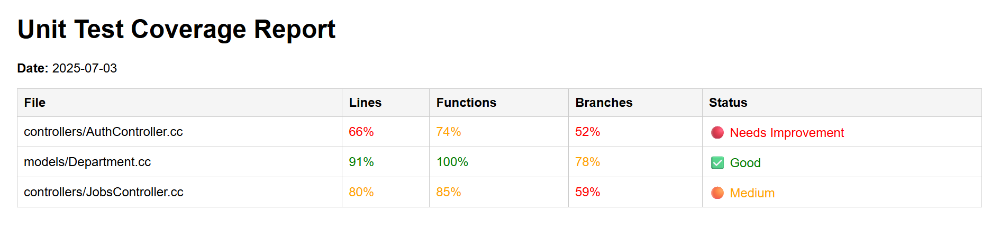
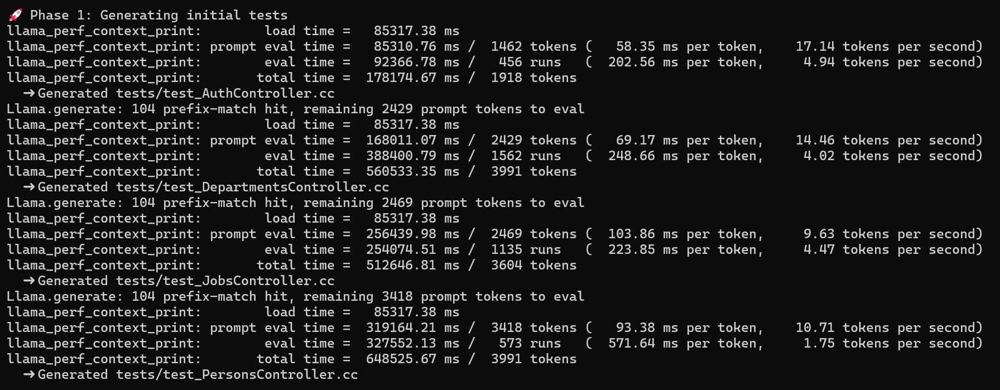
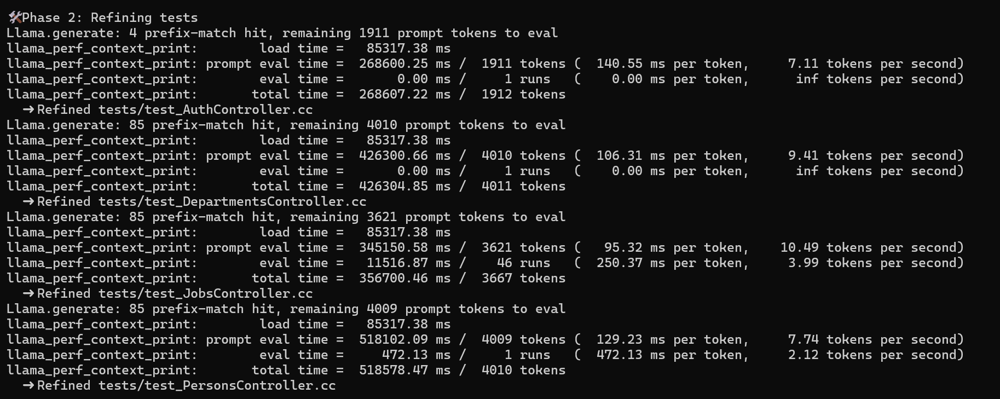
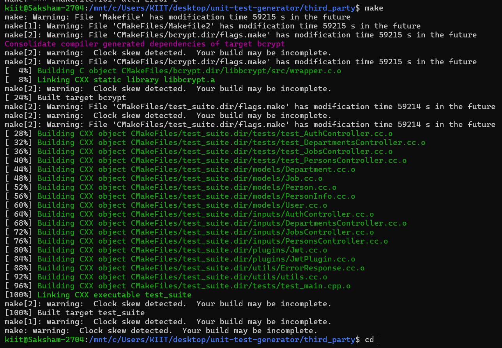

# 🚀 Unit Test Generator for Drogon C++ APIs

This project automates **unit test generation**, **test refinement**, **build verification**, and **coverage analysis** for a C++ Drogon-based application using a local LLM (like LLaMA). It integrates with `gcov`, `lcov`, and `genhtml` to visualize code coverage, and leverages LLM prompts to suggest test improvements.

---

## 🗂️ Project Structure

- ├── build/ # Compiled binaries and coverage files
- ├── inputs/ # Source code files to be tested
- ├── tests/ # Auto-generated and refined tests
- ├── prompts/ # YAML prompt templates (generation, refinement, fixing)
- ├── generate_tests.py # Test generation pipeline
- ├── coverage.sh # Shell wrapper for build + coverage
- ├── generate_coverage.py # Generates lcov coverage reports
- ├── analyze_coverage.py # Sends coverage to LLM for improvement suggestions
- ├── test_improvements.md # LLM output with suggestions
- ├── coverage_report/ # HTML coverage report (generated)
- ├── CMakeLists.txt # Build configuration with Drogon, GTest, JsonCpp, etc.

---

## ✅ Features

- 🧠 **LLM-Powered Unit Test Generation** (via YAML + local LLaMA)
- 🔄 **Automatic Test Refinement** to remove duplicates
- 🔧 **Build & Debug Failing Tests**
- 📊 **Coverage Visualization** using `lcov` + `genhtml`
- 🧪 **Improvement Suggestions** using LLM from coverage
- 🗃️ Minimal dependencies: works locally with no database

---

## 🔧 Prerequisites

- GCC with `gcov`
- CMake ≥ 3.10
- Drogon C++ Framework
- [JsonCpp](https://github.com/open-source-parsers/jsoncpp)
- GTest
- `lcov`, `genhtml`
- Local LLM setup (e.g. `llama.cpp`, `llm_integration.py`)

---

##Install required packages (Ubuntu):

```bash
sudo apt install cmake lcov gcovr g++ libjsoncpp-dev libgtest-dev

```

----

## 🧪 How to Run
### 1. Build the Test Suite
```bash
mkdir -p build
cd build
cmake ..
make
```
### 2. Run Tests
```bash
ctest
```
### 3. Generate Coverage
```bash
python3 generate_coverage.py
```
### 4. Generate Coverage
```bash
python3 generate_coverage.py
```

---

## 🧠 LLM Prompt Files
- prompts/prompt1.yaml: Generate unit tests from C++ source

- prompts/prompt2.yaml: Refine/remove duplicate tests

- prompts/prompt3.yaml: Fix build errors in failing tests

---

## 🔄 Workflow Diagram
graph TD
    A[inputs/*.cc] --> B[generate_tests.py]
    B --> C[tests/*.cc]
    C --> D[Build + Run Tests]
    D --> E[generate_coverage.py]
    E --> F[coverage_report/index.html]
    F --> G[analyze_coverage.py]
    G --> H[test_improvements.md]

---
## 📂 Example Output
### 📉 Coverage Summary:

- lines......: 78.3%
- functions..: 85.1%
- branches...: 62.4%

---

## 📄 License
MIT License © 2025

---

## 🗃️ Screenshots :
### ✅ Coverage Report


### 💡 LLM Test Suggestions


### 💡 Phase 1


### 💡 Phase 2


### 💡 Build


---


